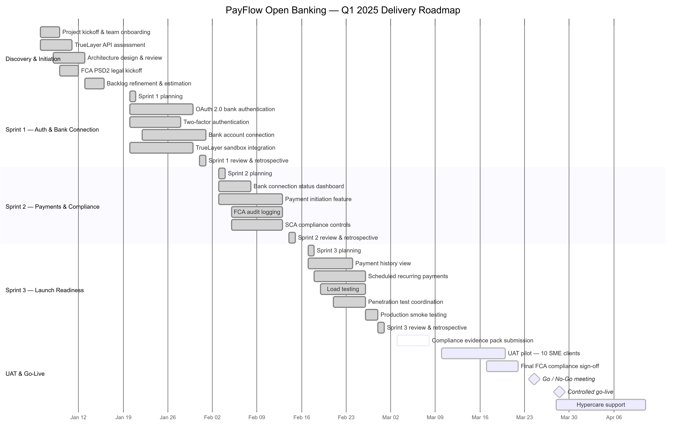

# PayFlow Open Banking Payments — Agile PMO Delivery Simulation

## Project Overview

This project is a professional Agile PMO delivery simulation for a fictional fintech company, **PayFlow Ltd**.

PayFlow is a B2B SaaS fintech platform used by SME clients for payment reconciliation. Clients currently fund their PayFlow wallets using manual bank transfers, causing a 2–3 day settlement delay. This project simulates the Agile delivery of an Open Banking payments feature that allows clients to fund their PayFlow wallets in under 60 seconds.

The project demonstrates end-to-end Agile project management, Scrum delivery, stakeholder communication, risk management, sprint planning, roadmap planning, and delivery governance.

---

## Professional Role Demonstrated

**Project Manager · Scrum Master · Delivery Lead**

This project demonstrates practical capability in:

- Agile Scrum delivery
- Sprint planning and execution
- Product backlog management
- Jira-based delivery tracking
- Stakeholder communication
- RAID and risk management
- RACI and governance
- Sprint reviews and retrospectives
- Weekly RAG reporting
- Delivery roadmap planning
- Velocity and burndown tracking
- UAT and go-live readiness planning

---

## Business Problem

PayFlow clients currently fund their wallets manually through bank transfers. This creates:

- 2–3 day settlement delays
- Poor customer experience
- Competitive disadvantage
- Delayed enterprise sales opportunities
- Operational inefficiency

Competitors are offering instant wallet funding through Open Banking. PayFlow needs to deliver a secure, compliant, and scalable Open Banking payments feature within a 13-week delivery window.

---

## Proposed Solution

The proposed solution is an Open Banking payments feature that allows clients to:

- Connect their UK business bank account securely
- Authenticate through OAuth 2.0
- Initiate payments directly from bank account to PayFlow wallet
- Complete Strong Customer Authentication before payment processing
- View payment history and transaction status
- Use scheduled recurring payments
- Maintain full audit logging for FCA PSD2 compliance

---

## Delivery Methodology

| Area | Detail |
|------|--------|
| Methodology | Agile Scrum |
| Delivery Timeline | 13 weeks |
| Sprint Count | 3 delivery sprints |
| Sprint Length | 2 weeks |
| Project Domain | Fintech / Open Banking / Payments |
| Tools Used | Jira, GitHub, Markdown, Mermaid, Excel-style reporting |
| Delivery Role | Scrum Master / Project Manager |

---

## Project Artefacts

### 1. Project Initiation

| Artefact | Location |
|---------|----------|
| Project Charter | `project-initiation/project_charter.md` |
| RACI Matrix | `project-initiation/raci_matrix.md` |
| Stakeholder Register | `project-initiation/stakeholder_register.md` |

---

### 2. Product Backlog

| Artefact | Location |
|---------|----------|
| Product Epics | `backlog/epics.md` |
| User Stories | `backlog/user_stories.md` |

The backlog includes:

- 4 product epics
- 9 user stories
- Gherkin-style acceptance criteria
- Story points
- Sprint allocation
- Priorities

---

### 3. Sprint Delivery Artefacts

| Sprint | Plan | Review | Retrospective |
|--------|------|--------|---------------|
| Sprint 1 | `sprints/sprint-01/sprint_plan.md` | `sprints/sprint-01/sprint_review.md` | `sprints/sprint-01/retrospective.md` |
| Sprint 2 | `sprints/sprint-02/sprint_plan.md` | `sprints/sprint-02/sprint_review.md` | `sprints/sprint-02/retrospective.md` |
| Sprint 3 | `sprints/sprint-03/sprint_plan.md` | `sprints/sprint-03/sprint_review.md` | `sprints/sprint-03/retrospective.md` |

---

### 4. Risk Management

| Artefact | Location |
|---------|----------|
| Risk Register | `risk-management/risk_register.md` |

The risk register includes:

- 7 project risks
- Likelihood and impact scoring
- Risk heat map
- Mitigation actions
- Contingency plans
- Risk governance notes

---

### 5. Stakeholder Communication

| Artefact | Location |
|---------|----------|
| Status Report Template | `stakeholder-comms/status_report_template.md` |
| Week 1 Status Report | `stakeholder-comms/weekly-reports/week-01.md` |
| Week 4 Status Report | `stakeholder-comms/weekly-reports/week-04.md` |
| Week 8 Status Report | `stakeholder-comms/weekly-reports/week-08.md` |
| Escalation Matrix | `stakeholder-comms/escalation_matrix.md` |

---

### 6. Roadmap and Metrics

| Artefact | Location |
|---------|----------|
| Q1 Delivery Roadmap | `roadmap/q1_roadmap.md` |
| Milestone Tracker | `roadmap/milestone_tracker.md` |
| Velocity Data | `metrics/velocity_data.md` |

---

## Sprint Summary

| Sprint | Goal | Committed Points | Completed Points | Velocity |
|--------|------|------------------|------------------|----------|
| Sprint 1 | OAuth authentication and bank connection foundation | 42 | 39 | 39 |
| Sprint 2 | Payment initiation, SCA, and audit logging | 37 | 37 | 37 |
| Sprint 3 | Launch readiness, testing, and UAT preparation | 34 | 34 | 34 |
| **Average** | | **37.7** | **36.7** | **36.7** |

---

## Key Delivery Outcomes

- Delivered all three sprint goals
- Maintained average velocity above 35 points
- Completed 97.4% of committed story points
- Completed Open Banking authentication and payment initiation flow
- Delivered SCA and audit logging controls
- Completed load testing for 5,000 concurrent users
- Completed production smoke testing
- Prepared UAT pilot for 10 SME clients
- Finished with zero open P1 or P2 defects

---

## Q1 Delivery Roadmap

The roadmap is documented in:

`roadmap/q1_roadmap.md`





---

## Repository Structure

```text
payflow-agile-pmo/
│
├── backlog/
│   ├── epics.md
│   └── user_stories.md
│
├── metrics/
│   └── velocity_data.md
│
├── project-initiation/
│   ├── project_charter.md
│   ├── raci_matrix.md
│   └── stakeholder_register.md
│
├── risk-management/
│   └── risk_register.md
│
├── roadmap/
│   ├── milestone_tracker.md
│   ├── q1_roadmap.md
│   └── q1_roadmap.png
│
├── sprints/
│   ├── sprint-01/
│   ├── sprint-02/
│   └── sprint-03/
│
├── stakeholder-comms/
│   ├── escalation_matrix.md
│   ├── status_report_template.md
│   └── weekly-reports/
│
├── .gitignore
└── README.md
```

---

## Portfolio Value

This project is designed to demonstrate practical Agile delivery capability in a fintech environment.

It shows that I can:

- Structure a professional Agile PMO project
- Translate a business problem into sprint-based delivery
- Manage backlog, sprint goals, reviews, and retrospectives
- Track delivery through velocity and burndown data
- Communicate project status using RAG reports
- Manage risks, escalations, and stakeholder expectations
- Prepare a project for UAT, compliance sign-off, go-live, and hypercare

---

## Project Status

**Status:** Completed as a portfolio simulation  
**Domain:** Fintech / Open Banking / Payments  
**Role:** Scrum Master / Project Manager  
**Delivery Style:** Agile Scrum  