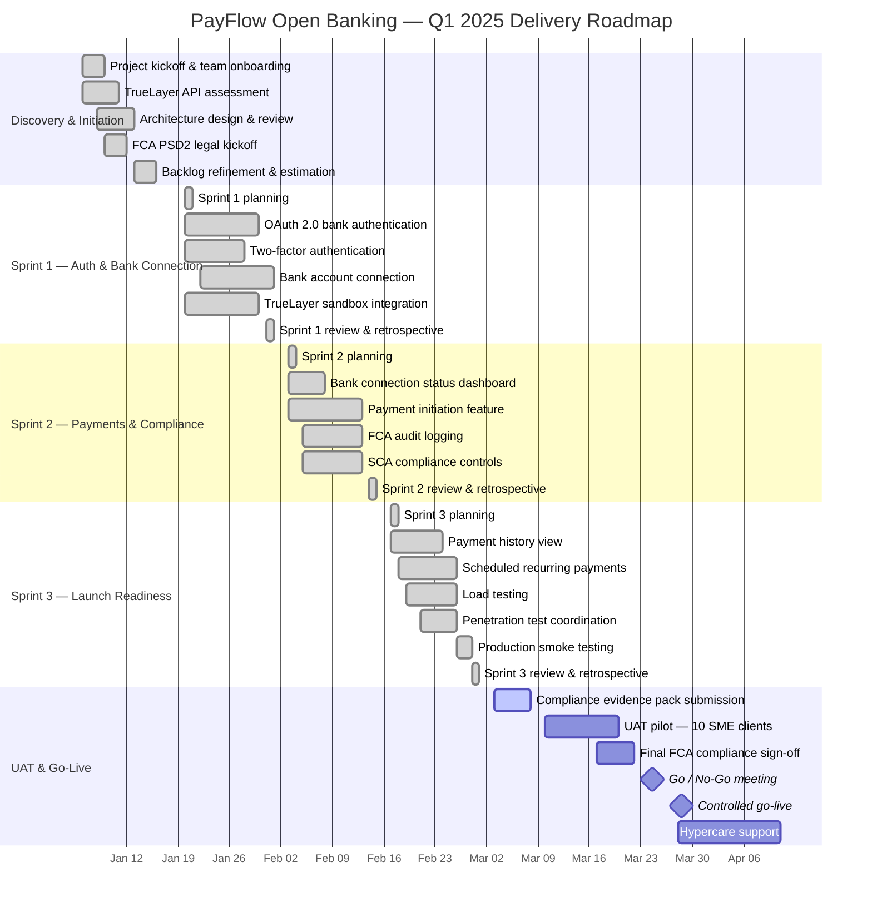

# Q1 2025 Delivery Roadmap
## PayFlow Open Banking Payments Feature

This roadmap shows the 13-week Agile delivery timeline for the PayFlow Open Banking Payments feature, from project initiation through sprint delivery, UAT, go-live, and hypercare.

---

## Roadmap Overview

| Phase | Timeline | Key Outcome |
|-------|----------|-------------|
| Discovery & Initiation | Weeks 1–2 | Project setup, stakeholder alignment, backlog readiness |
| Sprint 1 | Weeks 3–4 | OAuth authentication and bank connection foundation |
| Sprint 2 | Weeks 5–6 | Payment initiation, SCA, and audit logging |
| Sprint 3 | Weeks 7–8 | Payment history, scheduled payments, performance, security, and UAT readiness |
| UAT & Go-Live | Weeks 9–13 | Compliance sign-off, pilot testing, controlled go-live, and hypercare |

---

## Mermaid Gantt Chart

---

## Key Delivery Milestones

| Milestone | Target Date | Status | Notes |
|-----------|-------------|--------|-------|
| Project kickoff completed | 2025-01-08 | Done | Team onboarded and project initiated |
| Backlog refined and estimated | 2025-01-15 | Done | Initial backlog prepared for sprint planning |
| Sprint 1 completed | 2025-01-31 | Done | OAuth and bank connection foundation delivered |
| Sprint 2 completed | 2025-02-14 | Done | Payment initiation, SCA, and audit logging delivered |
| Sprint 3 completed | 2025-02-28 | Done | Launch-readiness work completed |
| Compliance evidence pack submitted | 2025-03-03 | In Progress | Final evidence prepared for Legal review |
| UAT pilot started | 2025-03-10 | Planned | 10 SME clients selected for pilot |
| Final compliance sign-off | 2025-03-21 | Planned | Required before payment feature launch |
| Go / No-Go meeting | 2025-03-24 | Planned | Sponsor decision before release |
| Controlled go-live | 2025-03-28 | Planned | Controlled release followed by hypercare |
| Hypercare completed | 2025-04-11 | Planned | Two-week post-launch support period |

---

## Roadmap Notes

- The delivery timeline is structured around three Agile sprints following a discovery and initiation phase.
- Sprint 1 focuses on authentication and secure bank connection.
- Sprint 2 delivers the core payment initiation journey with compliance controls.
- Sprint 3 focuses on launch readiness, including performance testing, security testing, UAT preparation, and final feature completion.
- The final phase includes compliance review, pilot testing, go-live approval, controlled release, and hypercare support.